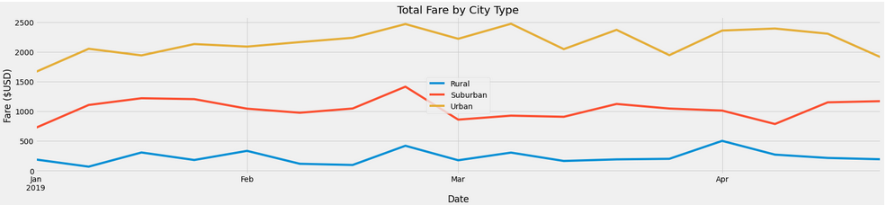
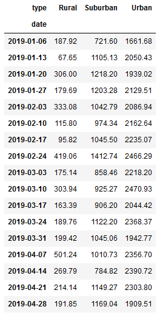
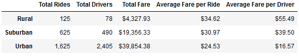

# PyBer Analysis with Python: Analyzing Ride-Sharing Data with Tables and Graphs

## Overview of Project

### Background
Initially, there were two different datasets. The first dataset was of rides with data elements for the city where the ride took place, the date of the ride, the fare in US dollar value, and the ride identification number. There were 120 cities and a total of 2,375 data rows for 2,375 rides. The dates of the dataset began on January 1st, 2019 and ended on May 8th, 2019. The second dataset was of the cities with data elements for the city, the count of total drivers in each city, and the type of city. The type of city includes urban, rural, and suburban.

The two datasets are then merged into a complete dataset premised on the city's name such that the data elements from the city dataset are added to the end of the ride database in a new dataset called “pyber_data_df” via a Pandas script so that the columns read from left to right are for the city of ride, date of ride, fare in US dollar value, the ride identification number, driver count in the city, and city type.

### Purpose
The purpose of this script is to determine general trends in ride-sharing for each type of city. This is done by obtaining the values for the total rides, total drivers, total fare, average fare per ride, and average fare per driver for each city type which be used to demonstrate the typical remuneration for drivers and for rides relative to one another in different city type. Additionally, this is also demonstrated with a multiple-line graph that tracks the trends in total weekly fare for each city type over the course of time which demonstrates how much fare is earned weekly in each city type and how that changed over time. This can be used to identify disparities in pay for drivers and for rides by each city type.

## Ride Share Analysis Results

### Analysis Results

The above graph demonstrates the relationship between the date and total weekly fare for each of the three different city types. One can note the significant difference between the total weekly fares amongst the three different city types. The average difference between urban drivers and suburban drivers appears to be roughly around $1,100, the average difference between suburban and rural drivers appears to be roughly around $800, and the average difference between urban and rural drivers appear to be roughly around $1,900. This can be also shown in the above table of which the source of data for the multiple-line graph. 

Additionally, urban drivers have seen growth in total weekly fares from roughly $1,660 in the beginning of January to roughly $1,910 at the end of April, a difference of roughly $250 when these figures are rounded to the nearest tens. This is in contrast to suburban drivers, who have seen growth in total weekly fares from roughly $720 in the beginning of January to roughly $1,170 at the end of April, a difference of roughly $450 when these figures are rounded to the nearest tens, and rural drivers, who have not seen growth at all when rounded to the nearest tens with total weekly fares at $190 in the beginning of January and the end of April. There is tremendous variation week-to-week for all three city types over the course of the reported time period but the overall general trend in the graph appears to be growth for urban and suburban drivers in total weekly fares but not for rural drivers.

It may appear to be the case that urban drivers do better financially in total weekly fares in comparison to suburban and rural drivers in general while suburban drivers see the most growth over time for total weekly fares. However, the following table could demonstrate an opposing perspective.

The above table shows the total number of rides for each city type, the total number of drivers for each city type, the total fare for each city type, the average fare per ride for each city type, and the average fare per driver for each city type. There is a total of 125 rides for rural cities, 625 rides for suburban cities, and 1,625 rides for urban cities. There is a total of 78 drivers for rural cities, 490 drivers for suburban cities, 2,405 drivers for urban cities. The total fare is $4,327.93 for rural cities, $19,356.33 for suburban cities, and $39,854.38 for urban cities. The average fare per ride is $34.62 for rural cities, $30.97 for suburban cities, and $24.53 for urban cities. And finally, the average fare per driver is $55.49 for rural cities, $39.50 for suburban cities, and $16.57 for urban cities.

The above demonstrates that the average fare per ride is higher for rural drivers in comparison to suburban drivers, $3.65 more, and in comparison to urban drivers, $10.09 more. The average fare per ride for suburban drivers is $6.44 higher than urban drivers. Likewise, the average fare per driver is higher for rural drivers in comparison to suburban drivers, $15.99 more, and in comparison to urban drivers, $38.92 more. The average fare per driver for suburban drivers is $22.93 higher than urban drivers. What this appears to demonstrate is that rural drivers are paid more as a whole per driver in comparison to suburban and urban drivers, and urban drivers are the worst paid for each individual driver. Also, rural drivers are paid more for each unit of work, so to speak in terms of their payment per ride, in comparison to suburban and urban drivers, and urban drivers are the worst paid if each ride is considered the relevant unit of account for working in the ride sharing industry. This per driver analysis clearly contrasts with the overall total weekly fare graphical perspective which seems to illustrate that urban drivers as a unit are paid better than suburban and rural drivers as a unit.

## Summary

### Business Recommendations to Chief Executive Officer (CEO)
The first recommendation to be made to the CEO is to improve data collection with respect to distance driven for each ride. This is to improve analysis to determine a more granular outlook in the future in terms of the fare earned by each driver on average for each mile driven in each city type. This can help to better determine if there is a discrepancy in fare paid depending on the city type or if the appearance of a discrepancy is merely a function of different distances driven on average among different city types and pricing for rides that could include distance driven for the ride as a part of the calculation in contrast to city type in of itself as the relevant causal variable or some other variable correlated with city type.

The second recommendation to be made to the CEO, after the further granular analysis stipulated above, is, if there is a discrepancy for fare paid per mile, is to consider a modifier to the formula that determines pricing. This could be a positive value greater than one to be used as a coefficient to be attached to the pricing function for the city type of the drivers who are suffering a pay discrepancy. For example, “P = a * f(x)” where “P” signifies price, “f(x)” signifies the typical pricing function, and “a” signifies the coefficient. This ensures that on average that drivers of each city type are more likely to be paid equally for each mile driven for each ride. This would be calculated based on the surveyed difference in average fare paid per mile for each city type and can be updated quarterly to take into account weekly or monthly fluctuations.

The third recommendation that can be made to the CEO is to have a “minimum fare earned per mile driven” policy instituted for the firm. This “minimum fare earned per mile driven” will be calculated weekly based on the city type that has the highest average fare per mile. If the average fare per mile by a driver in any city type is below the “minimum fare earned per mile driven” fare calculated for that week then the firm will make up for it by paying the driver the difference between the “minimum fare earned per mile driven” fare for the week and their average fare per mile for the week for each mile that they drove that week.
